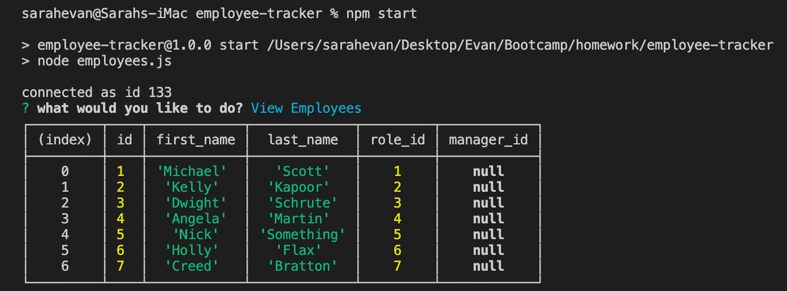
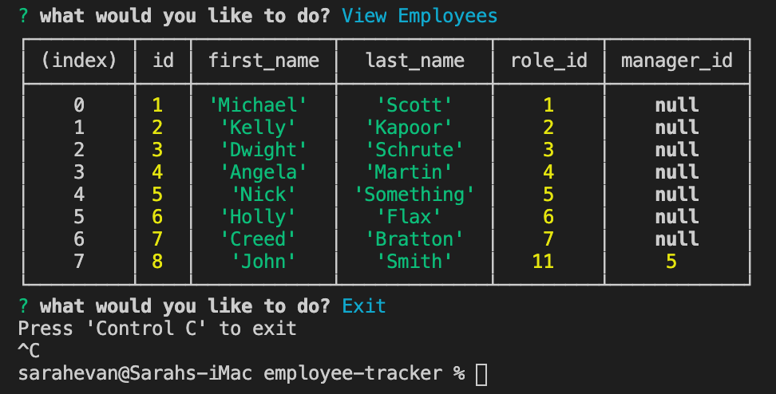

# Employee Tracker

## Table of Contents
* [Installation](#installation)
* [Description](#discription)
* [Contribution](#contribution)
* [Contact](#contact)

## Installation

To run the program, users are required to install 'express'. You will install using the following on the index.js:

    npm i

To run the program users will do one of two things in the integrated terminal associated with the index.js:

    npm start

## Description

The employee tracker is an app created to manage employees based on certain parameters such as department, job title, salary, manager, and more. The employee tracker helps maintain all workers parameters and update that information as employees come and go in the work place.

Using the command prompt, switch statements, MySQL database management, I was able to navigate prompts to pull information from the datasets and present it to the user in an easy to read table. The option to add a department, role, or new employee will pull existing data from the tables to add with the created departement, role, or id.

## Contribution

If you think you can add functionality to this project, see a bug, or have styling suggestions, please feel free to message me through one of my contact options listed below.

# Contact

* Email: evanfurniss@gmail.com
* LinkedIn: https://www.linkedin.com/in/evan-furniss/
* GitHub: https://github.com/evanfurniss

## Demo

Check out the file demo video here: https://drive.google.com/file/d/1JjIc8waLNFXkwjftCE94jvV_0TSRRgdg/view

